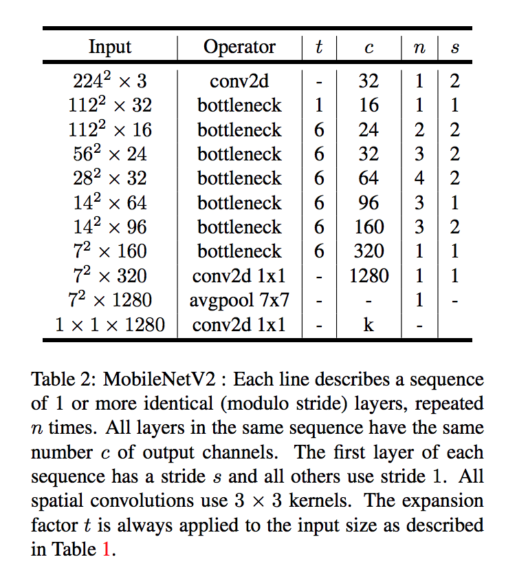
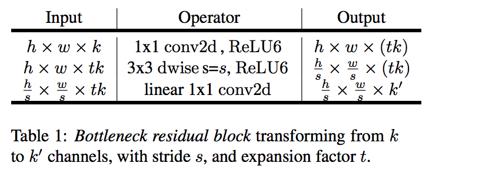

## MobileNetv2  Implementation
This repository is about MobileNet in Tensorflow 2.  
I used tf.keras.Model and tf.layers.Layer instead of tf.keras.models.Sequential.  
This allows us to customize and have full control of the model.  
I also used custom training instead of relying on the fit() function.  
In case we have very huge dataset, I applied online loading (by batch) instead of loading the data completely at the beginning. This will eventually not consume the memory.  

#### The Applications of MobileNetv2
<p></p>
<center>   

</center>

Figure 1: image is taken from [source](https://ai.googleblog.com/2018/04/mobilenetv2-next-generation-of-on.html)   

#### The Block Architecture
<p></p>
<center>   
   
</center>

Figure 2: image is taken from [source](https://arxiv.org/pdf/1801.04381.pdf)   

#### The MobileNetv2 Architecture
<p></p>
<center>   

</center>
<p></p>
<center>

</center>

Figure 3: images are taken from [source](https://arxiv.org/pdf/1801.04381.pdf)   
### Training on MNIST
<p></p>
<center>  

</center>

### Requirement
```
python==3.7.0
numpy==1.18.1
```
### How to use
Training & Prediction can be run as follows:    
`python train.py train`  
`python train.py predict img.png`  


### More information
* Please refer to the original paper of MobileNet [here](https://arxiv.org/pdf/1801.04381.pdf) for more information.

### Implementation Notes
* **Note 1**:   
Since datasets are somehow huge and painfully slow in training ,I decided to make number of filters variable. If you want to run it in your PC, you can reduce the number of filters into 4 or 2. (8 is by default). For example:  
`model = mobilenetv2.MobileNetv2((113, 113, 3), classes = 10, filters = 4)`

* **Note 2** :   
You can also make the size of images smaller, so that it can be ran faster and doesn't take too much memories.

### Result for MNIST:   
* Learning rate = 0.0005  
* Batch size = 32  
* Optimizer = RMSprop   
* Filters = 8
* epochs = 2

Name |  Training Accuracy |  Validation Accuracy  |
:---: | :---: | :---:
MobileNetv2 | 90.34% | 96.24%
